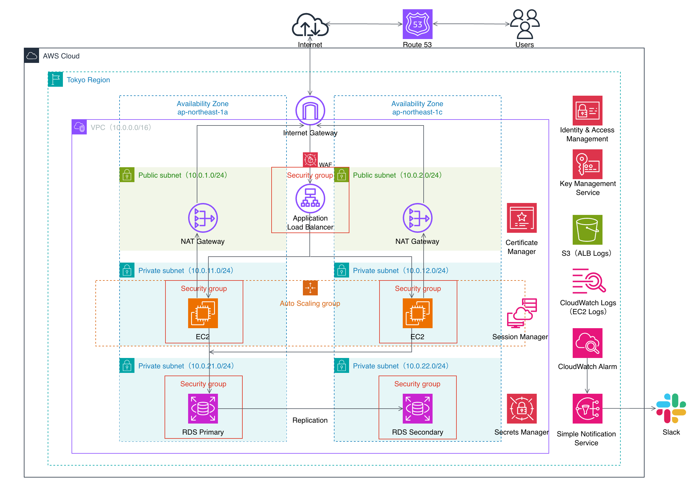

# Dev Portfolio

---

## ■ Overview

Terraformを用いてAWS上に構築する、冗長化・可用性を考慮した社内向け申請管理システム基盤です。  
バックエンドにはFastAPIを採用し、認証・承認フローを含む業務ロジックを実装しています。

本プロジェクトでは、以下を重視しています：

- 実務を意識したアーキテクチャ設計
- AWSを用いた本番構成
- Dockerによる環境統一
- TerraformによるIaC化

---

## ■ Architecture



### Architecture Flow

Users<br>
↓<br>
ALB（Application Load Balancer）<br>
↓<br>
EC2（Docker + FastAPI）<br>
↓<br>
RDS（PostgreSQL）

---

## ■ Request Flow

1. Users → ALB  
2. ALB → EC2（FastAPI）  
3. FastAPI → Service Layer  
4. Service → PostgreSQL（RDS）  
5. 処理結果をレスポンスとして返却  

---

## ■ Tech Stack

### Backend
- FastAPI
- SQLAlchemy
- Pydantic
- PostgreSQL
- JWT認証（OAuth2 Password Flow / python-jose）

### Infrastructure
- AWS VPC（Public / Private Subnet）
- AWS Route 53
- AWS Application Load Balancer
- AWS EC2 Auto Scaling
- AWS RDS for PostgreSQL
- AWS WAF
- AWS IAM / Security Group
- AWS Systems Manager
- AWS Secrets Manager
- AWS CloudWatch / SNS
- Slack（AWS Chatbot Notifications）

### IaC
- Terraform

### DevOps
- Docker / Docker Compose
- GitHub
- GitHub Actions（予定）

---

## ■ Features

- 認証（JWT）
- 申請作成・ページネーション付き一覧取得
- 承認 / 却下フロー

---

## ■ System Design

### ネットワーク構成

- Public Subnet
  - ALB
- Private Subnet
  - EC2（アプリケーション）
  - RDS（DB）

---

### セキュリティ設計

- 認証・認可の実装
- ネットワークレベルのアクセス制御
- 機密情報の安全な管理

---

## ■ Directory Structure

```text
.
├── backend/                                     # FastAPIバックエンド（Docker / テスト含む）
│   ├── app/                                     # アプリケーション本体
│   ├── tests/                                   # テストコード
│   ├── docker-compose.yml                       # ローカル開発用
│   ├── Dockerfile                               # アプリケーションコンテナ定義
│   └── README.md                                # バックエンド詳細
│
├── infra/                                       # インフラ構成（Terraform）
│   ├── bootstrap/                               # Terraform Backend用S3作成
│   ├── envs/                                    # dev / prod 環境
│   ├── modules/                                 # Terraform modules
│   └── README.md                                # インフラ詳細
│
├── docs/                                        # 設計資料
│   └── architecture.png                         # システム構成図
│
├── .gitignore                                   # Git除外設定
└── README.md                                    # ルートREADME
```

---

## ■ Local Development

```bash
cd backend
docker compose up --build
```

### アクセス

- Local:
  - API Docs: [http://localhost:8000/docs](http://localhost:8000/docs)
  - Swagger UI から OAuth2 Password Flow によるJWT認証を実行可能

- Public:
  - API Docs: [https://app.sakuyadev.com/docs](https://app.sakuyadev.com/docs)
  - 構成: HTTPS / ALB / ACM

---

## ■ Deployment

AWS上のEC2およびRDSを利用してアプリケーションを公開しています。  
詳細は各READMEを参照してください。

---

## ■ Documents

- [Backend詳細](backend/README.md)
- [Infrastructure詳細](infra/README.md)

---

## ■ Future Improvements

- CI/CD Pipeline の自動化（GitHub Actions）
- Docker Hub を利用したコンテナイメージ配布
- Blue / Green Deployment
- CloudWatch Dashboard の整備
- 本番運用を想定した監視・デプロイ改善

---

## ■ Author

Sakuya Aradono  
- GitHub: [sakuyaxx21-sys](https://github.com/sakuyaxx21-sys)  
- App: [app.sakuyadev.com](https://app.sakuyadev.com)
