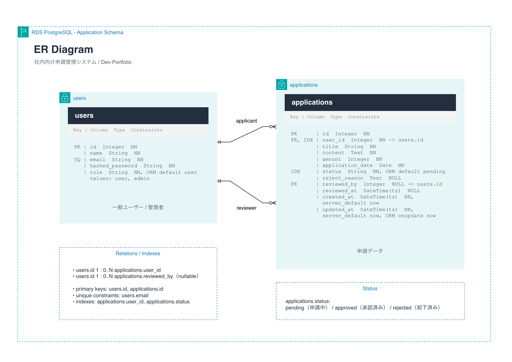

# 基本設計書

---

## ■ Overview

本ドキュメントは、社内向け申請管理システム基盤の基本設計を整理するものです。  
要件定義に基づき、AWS上のインフラ構成、FastAPIアプリケーション構成、データ設計、運用設計を定義します。

本システムは、ALB / EC2 Auto Scaling / RDS PostgreSQL を中心としたWeb三層構成とし、Terraformで再現可能なインフラとして管理します。

---

## ■ Architecture


### Architecture Flow

Users<br>
↓<br>
Route 53<br>
↓<br>
ALB（HTTPS / ACM / WAF）<br>
↓<br>
EC2 Auto Scaling Group（Docker + FastAPI）<br>
↓<br>
RDS PostgreSQL（Private DB Subnet）

---

## ■ System Components

| 分類 | コンポーネント | 概要 |
| --- | --- | --- |
| DNS | Route 53 | 公開ドメインの名前解決 |
| TLS | ACM | ALB用証明書の発行・検証 |
| Web | ALB | HTTP→HTTPSリダイレクト、HTTPS終端、EC2への転送 |
| Security | WAF | AWS Managed RulesによるWeb攻撃対策 |
| App | EC2 Auto Scaling Group | Docker上でFastAPIを実行 |
| DB | RDS PostgreSQL | 申請・ユーザーデータの永続化 |
| Secret | Secrets Manager | DB認証情報、アプリケーションSecretの管理 |
| Encryption | KMS | RDS、Secrets Manager等の暗号化 |
| Logs | CloudWatch Logs / S3 | OSログ、Dockerログ、ALBアクセスログの保存 |
| Monitoring | CloudWatch Alarm / SNS / AWS Chatbot | 異常検知とSlack通知 |
| CI/CD | GitHub Actions | CI、アプリケーションCD、Terraform plan / apply |

---

## ■ Network Design

本システムはAWS東京リージョン（`ap-northeast-1`）の2AZ構成とします。

| 項目 | 値 |
| --- | --- |
| VPC CIDR | `10.0.0.0/16` |
| Availability Zones | `ap-northeast-1a` / `ap-northeast-1c` |
| Public Subnet | `10.0.1.0/24` / `10.0.2.0/24` |
| Private App Subnet | `10.0.11.0/24` / `10.0.12.0/24` |
| Private DB Subnet | `10.0.21.0/24` / `10.0.22.0/24` |

### サブネット用途

| サブネット | 用途 |
| --- | --- |
| Public Subnet | ALB、NAT Gateway |
| Private App Subnet | EC2 Auto Scaling Group |
| Private DB Subnet | RDS PostgreSQL |

### ルーティング

- Public SubnetはInternet Gatewayへデフォルトルートを持つ
- Private App SubnetはNAT Gateway経由で外部通信を行う
- Private DB Subnetはインターネット向けデフォルトルートを持たない
- dev環境はNAT Gateway 1台、prod環境はNAT Gateway 2台を既定値とする

---

## ■ Infrastructure Design

### ALB

- Public Subnetに配置する
- HTTP（80）をHTTPS（443）へリダイレクトする
- HTTPS ListenerでACM証明書を利用する
- Target Groupのヘルスチェックは `/api/v1/health` を利用する
- ALBアクセスログをS3へ保存する
- WAF Web ACLを関連付ける

### EC2 Auto Scaling Group

- Private App Subnetに配置する
- Amazon Linux 2023 AMIを利用する
- インスタンスタイプは既定で `t3.micro` とする
- アプリケーションはDockerコンテナとして起動する
- Launch Templateのuser dataでDocker、AWS CLI、CloudWatch Agent等をセットアップする
- Secrets ManagerからDB接続情報とアプリケーションSecretを取得する
- 起動時にAlembic migrationを実行する
- ALB Target Groupに登録し、ELBヘルスチェックで管理する

### RDS PostgreSQL

- Private DB Subnetに配置する
- PostgreSQLを利用する
- インスタンスクラスは既定で `db.t4g.micro` とする
- ストレージはgp3を利用し、KMSで暗号化する
- master passwordはAWS管理のSecrets Manager Secretとして管理する
- dev環境はMulti-AZ無効、バックアップ保持0日、削除保護無効とする
- prod環境はMulti-AZ有効、バックアップ保持7日、削除保護有効とする

### Security

- ALB Security Groupはインターネットからの80 / 443のみ受け付ける
- EC2 Security GroupはALBからのアプリケーションポートのみ受け付ける
- RDS Security GroupはEC2からの5432のみ受け付ける
- EC2へのSSH接続は許可せず、Systems Managerを利用する
- GitHub ActionsはOIDCによりAWS RoleをAssumeする

---

## ■ Application Design

### Backend Stack

- FastAPI
- SQLAlchemy
- Alembic
- Pydantic
- PostgreSQL
- python-jose
- OAuth2PasswordBearer / OAuth2PasswordRequestForm
- pwdlib（argon2）

### Layer Design

```text
Router
↓
Dependencies
↓
Service Layer
↓
Repository Layer
↓
SQLAlchemy ORM
↓
PostgreSQL
```

### 責務

| レイヤ | 責務 |
| --- | --- |
| Router | HTTPリクエスト受付、依存関係注入、レスポンスモデル指定 |
| Dependencies | 認証ユーザー取得、管理者権限確認、DB Session注入 |
| Service | 業務ロジック、例外判定、認可判断、ステータス更新 |
| Repository | DBクエリ、作成、更新、pagination |
| ORM Model | テーブル定義 |
| Schema | リクエスト / レスポンスの型定義 |

---

## ■ API Design

### API Prefix

```text
/api/v1
```

### Endpoint

| 分類 | Method | Endpoint | 認証 | 概要 |
| --- | --- | --- | --- | --- |
| Health | GET | `/api/v1/health` | 不要 | ヘルスチェック |
| Auth | POST | `/api/v1/auth/login` | 不要 | JSON形式のログイン |
| Auth | POST | `/api/v1/auth/token` | 不要 | Swagger UI用OAuth2ログイン |
| Users | GET | `/api/v1/users` | 不要 | ユーザー一覧取得 |
| Users | POST | `/api/v1/users` | 不要 | ユーザー作成 |
| Users | GET | `/api/v1/users/me` | 必要 | ログイン中ユーザー取得 |
| Users | GET | `/api/v1/users/{user_id}` | 不要 | ユーザー詳細取得 |
| Users | PUT | `/api/v1/users/{user_id}` | 不要 | ユーザー更新 |
| Users | DELETE | `/api/v1/users/{user_id}` | 不要 | ユーザー削除 |
| Applications | POST | `/api/v1/applications` | 必要 | 申請作成 |
| Applications | GET | `/api/v1/applications/me` | 必要 | 自身の申請一覧取得 |
| Admin | GET | `/api/v1/admin/applications` | 管理者 | 全申請一覧取得 |
| Admin | PATCH | `/api/v1/admin/applications/{application_id}/status` | 管理者 | 申請ステータス更新 |

### Pagination Response

```json
{
  "items": [],
  "total": 0,
  "page": 1,
  "limit": 10,
  "total_pages": 0
}
```

### Validation

| 対象 | 項目 | 条件 |
| --- | --- | --- |
| UserCreate | email | メールアドレス形式 |
| UserCreate | password | 8文字以上 |
| ApplicationCreate | title | 1文字以上、200文字以下 |
| ApplicationCreate | content | 1文字以上、2000文字以下 |
| ApplicationCreate | amount | 1以上 |
| ApplicationCreate | application_date | date形式 |
| ApplicationList | page | 1以上 |
| ApplicationList | limit | 1以上、100以下 |
| ApplicationStatusUpdate | status | `approved` または `rejected` |

---

## ■ Authentication / Authorization Design

### 認証

- `/api/v1/auth/login` はJSONリクエストでemail / passwordを受け取る
- `/api/v1/auth/token` はSwagger UIのOAuth2 Password Flow用にform-dataを受け取る
- passwordはargon2でハッシュ化して保存する
- JWTのsubjectにはemailを設定する
- 認証が必要なAPIではBearer tokenを検証する

### 認可

- ユーザーには `role` を持たせる
- 一般ユーザーの既定roleは `user` とする
- 管理者APIでは `role == "admin"` のユーザーのみ許可する
- 権限不足時はアプリケーション共通例外として扱う

---

## ■ Database Design



### users

| カラム | 型 | 制約 | 概要 |
| --- | --- | --- | --- |
| id | Integer | Primary Key, Not Null | ユーザーID |
| name | String | Not Null | ユーザー名 |
| email | String | Unique, Not Null | メールアドレス |
| hashed_password | String | Not Null | ハッシュ化済みパスワード |
| role | String | Not Null, ORM Default `user`, Values `user` / `admin` | 権限 |

### applications

| カラム | 型 | 制約 | 概要 |
| --- | --- | --- | --- |
| id | Integer | Primary Key, Not Null | 申請ID |
| user_id | Integer | Foreign Key, Index, Not Null | 申請者ID |
| title | String | Not Null | 申請タイトル |
| content | Text | Not Null | 申請内容 |
| amount | Integer | Not Null | 金額 |
| application_date | Date | Not Null | 申請日 |
| status | String | Index, Not Null, ORM Default `pending` | 申請ステータス |
| reject_reason | Text | Nullable | 却下理由 |
| reviewed_by | Integer | Foreign Key, Nullable | 承認 / 却下した管理者ID |
| reviewed_at | DateTime(tz) | Nullable | 承認 / 却下日時 |
| created_at | DateTime(tz) | Not Null, Server Default `now` | 作成日時 |
| updated_at | DateTime(tz) | Not Null, Server Default `now`, ORM On Update `now` | 更新日時 |

### Status

| 値 | 概要 |
| --- | --- |
| `pending` | 申請中 |
| `approved` | 承認済み |
| `rejected` | 却下済み |

### Relations

- `applications.user_id` は `users.id` を参照する
- `applications.reviewed_by` は `users.id` を参照する
- 申請一覧は `created_at` の降順で取得する

---

## ■ Error Design

Service層で発生した業務例外は、共通例外ハンドラでHTTPレスポンスへ変換します。

| 分類 | HTTP Status | 例 |
| --- | --- | --- |
| Conflict / Invalid Request | 400 | メールアドレス重複、不正な申請ステータス |
| Authentication | 401 | 認証情報不足、認証失敗、無効なtoken |
| Authorization | 403 | 管理者権限不足 |
| Not Found | 404 | ユーザーまたは申請が存在しない |
| Method Not Allowed | 405 | 許可されていないHTTP Methodでのアクセス |
| Validation Error | 422 | リクエストボディ、path parameter、query parameterのバリデーションエラー |

---

## ■ CI/CD Design

### CI

GitHub Actions CIはPull Request作成時およびmainブランチpush時に実行します。

- Python依存関係のインストール
- `backend` 配下のpytest実行
- `terraform fmt -check -recursive infra`
- dev / prod環境のTerraform validate

### CD

GitHub Actions CDにより、アプリケーションをEC2環境へデプロイします。

- Docker imageのbuild / push
- GitHub Actions OIDCによるAWS認証
- SSM Run CommandによるEC2デプロイ
- Alembic migration実行
- 既存コンテナ停止・削除
- 新しいDocker imageでコンテナ起動
- `/api/v1/health` によるヘルスチェック

### Terraform CD

Terraform CDは手動実行とし、対象環境と実行アクションを選択します。

- 対象環境: `dev` / `prod`
- 実行アクション: `plan` / `apply`
- Terraform Backend初期化
- format check
- validate
- plan
- apply

---

## ■ Monitoring Design

### CloudWatch Alarm

| 対象 | メトリクス | Severity | 通知先 |
| --- | --- | --- | --- |
| ASG | `GroupInServiceInstances` / `GroupDesiredCapacity` | `crit` | critical Slack channel |
| ASG | `CPUUtilization` | `warn` | warning Slack channel |
| Target Group | `UnHealthyHostCount` | `crit` | critical Slack channel |
| Target Group | `HTTPCode_Target_5XX_Count` | `warn` | warning Slack channel |
| ALB | `HTTPCode_ELB_5XX_Count` | `crit` | critical Slack channel |
| RDS | `CPUUtilization` | `warn` | warning Slack channel |
| RDS | `FreeStorageSpace` | `crit` | critical Slack channel |
| RDS | `DatabaseConnections` | `warn` | warning Slack channel |

### Logs

- EC2 OSログをCloudWatch Logsへ送信する
- DockerコンテナログをCloudWatch Logsへ送信する
- SSM関連ログを運用監査に利用する
- ALBアクセスログをS3へ保存する
- WAFログは不正アクセス分析に利用する

---

## ■ Naming Rules

### Terraform Resource Name

```text
{env}-{project}-{resource}-{role}
```

### CloudWatch Alarm Name

```text
{env}-{project}-ops-alarm-{resource}-{metric}-{severity}
```

### Severity

| 値 | 用途 |
| --- | --- |
| `crit` | 即時対応が必要な障害 |
| `warn` | 注意喚起・継続監視が必要な状態 |

### Tags

| Key | Value |
| --- | --- |
| Project | `portfolio` |
| Env | `dev` / `prod` |
| ManagedBy | `Terraform` |

---

## ■ Directory Structure

```text
.
├── backend/                                     # FastAPIバックエンド
│   ├── alembic/                                 # DBマイグレーション
│   ├── app/                                     # アプリケーション本体
│   │   ├── api/                                 # Router / Dependencies
│   │   ├── core/                                # 設定・セキュリティ・例外
│   │   ├── db/                                  # DB接続
│   │   ├── models/                              # SQLAlchemy ORM
│   │   ├── repositories/                        # DBアクセス
│   │   ├── schemas/                             # Pydantic Schema
│   │   └── services/                            # 業務ロジック
│   └── tests/                                   # pytest
│
├── infra/                                       # Terraform
│   ├── bootstrap/                               # Terraform Backend
│   ├── envs/                                    # dev / prod
│   └── modules/                                 # app / db / monitoring / network / operations / security
│
└── docs/                                        # 設計資料
    ├── requirements.md                          # 要件定義書
    ├── basic-design.md                          # 基本設計書
    ├── architecture.png                         # システム構成図
    └── er-diagram.png                           # ER図
```
